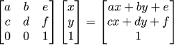

# tinyrenderer
An implement of https://github.com/ssloy/tinyrenderer

# Lession 4: Perspective Projection
> 投影就是把三维的场景变成观测到的二维图像，分为正交投影和透视投影
> 
> 透视投影和人眼观测到的成像差不多，有近大远小的效果；正交投影则没有近大远小的变化


为什么会近大远小呢？如下图zy坐标系上，A和B的y坐标一样，但是在2c处形成的投影则是A''处于更高的地方


## 二维几何
### Linear transformation 线性转换
对点(x, y)进行线性转换可以写成以下形式


对一系列点做线性转换


### Affine transformation 仿射转换

线性转换加上平移


## Homogeneous coordinates 齐次坐标系
齐次坐标是将一个原本n维的向量用一个n+1维的向量来表示

使用齐次坐标系，可以将仿射转换用一个矩阵表示



矩阵的最后一行，和透视投影中的视角(camera)有关

## 三维几何
假设camera在(0,0,c)上， 计算一个点(x,y,z)的投影


计算出来的点，可以用于渲染，用上z-buffer使用计算出来的z。之前渲染出来的画像，相当于c趋于无穷大的时候。

# Lesson 5
> https://blog.csdn.net/qq_36653924/article/details/130976716

## Change of basis in 3D space

这里介绍了在(i,j,k)坐标系下的坐标(x,y,z)，和(i',j',k')坐标系下的坐标(x',y',z')如何互相转换。先做平移，然后做线性转换，即一次仿射


> https://blog.csdn.net/weixin_44179561/article/details/124149297

现在有两个坐标系，一个是世界坐标系，另一个是摄像机坐标系，我们需要将世界坐标系中的坐标转换成摄像机坐标系内的坐标

## Let us create our own gluLookAt

这里给出中心点坐标c，摄像机坐标e，向量u（摄像机坐标系中，zy平面中的一个向量）。c是摄像机视角的正中心，以它为坐标系的原点，摄像机在z轴上

```c++
void lookat(Vec3f eye, Vec3f center, Vec3f up) {
    Vec3f z = (eye-center).normalize();
    Vec3f x = cross(up,z).normalize();
    Vec3f y = cross(z,x).normalize();
    Matrix Minv = Matrix::identity();
    Matrix Tr   = Matrix::identity();
    for (int i=0; i<3; i++) {
        Minv[0][i] = x[i];
        Minv[1][i] = y[i];
        Minv[2][i] = z[i];
        Tr[i][3] = -center[i];
    }
    ModelView = Minv*Tr;
}
```

这段代码，先计算出摄影机坐标系的xyz轴的基向量（用世界坐标系表示），也就是下图中的(i',j',k')。由于(i,j,k)是基向量，所以M其实是等于(i',j',k')的。


由于矩阵的特殊性质，M的逆是等于M的转置的，下面代码可以验证

```python
import numpy as np
def normal(v):
    return v / np.sqrt((v * v).sum())
v1 = np.array([1, 2, 3])
v2 = np.array([1, 1, 1])
z = normal(v1)
x = normal(np.cross(v2, z))
y = normal(np.cross(z, x))
M = np.mat([x, y, z])
print(M)
print(M.T)
```

这里有个小问题，就是上面是先做了平移，然后再做

## Transformation of normal vector

如果有一个模型以及它的法向量，并且这个模型用一个矩阵进行仿射(affine mapping)转换，那么法向量就是用这个矩阵的逆进行转换

